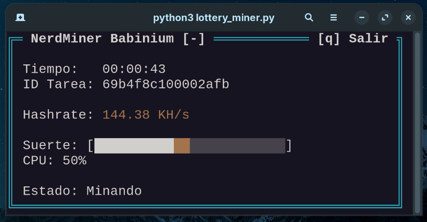

# 🚀 NerdMiner Babinium

NerdMiner Babinium es un simulador de minería de Bitcoin desarrollado en Python. Este proyecto está diseñado para mostrar estadísticas de minería en tiempo real directamente en tu terminal, con una interfaz visual moderna y dinámica.



## 📋 Características
- **Hashrate en tiempo real**: Visualiza la velocidad de procesamiento de tu equipo.
- **Barra de Suerte (Luck)**: Un indicador dinámico que muestra el rendimiento actual en comparación con el promedio reciente.
- **Interfaz TUI**: Interfaz de usuario basada en texto (Terminal User Interface) con colores y animaciones.
- **Multiprocesamiento**: Utiliza varios núcleos de tu CPU para maximizar la potencia de procesamiento.

## 💻 Compatibilidad
Este proyecto fue desarrollado originalmente en **Linux (Zorin OS)**, pero al estar escrito en Python, es totalmente compatible con **Windows**. 

> [!NOTE]
> En Windows, es necesario instalar una librería adicional para que la interfaz visual funcione correctamente (ver sección de Dependencias).

## 🛠️ Instalación y Uso

### 1. Clonar el repositorio
Primero, descarga los archivos a tu computadora.

### 2. Instalar Dependencias
Asegúrate de tener Python instalado. Luego, instala las librerías necesarias:

**En Linux:**
Normalmente no requiere dependencias externas adicionales para la interfaz.

**En Windows:**
Debes instalar `windows-curses` para que la pantalla funcione:
```bash
pip install windows-curses
```

### 3. Configuración Importante
Antes de empezar, abre el archivo `config.txt`. 

> [!IMPORTANT]
> **Debes cambiar la dirección de la billetera (wallet) por la tuya.** La dirección que viene por defecto es solo para pruebas.

Ejemplo de `config.txt`:
```text
wallet=TU_DIRECCION_DE_BILLETERA_AQUI
intensity=50
```
- `wallet`: Tu dirección de Bitcoin.
- `intensity`: El porcentaje de uso de tu CPU (0 a 100).

### 4. Ejecutar el Minero
Simplemente corre el script con Python:
```bash
python nerdminer_babinium.py
```

## ⌨️ Controles
- Pulsa **[q]** en cualquier momento para salir del programa de forma segura.

---
Desarrollado con ❤️ para la comunidad de minería.
